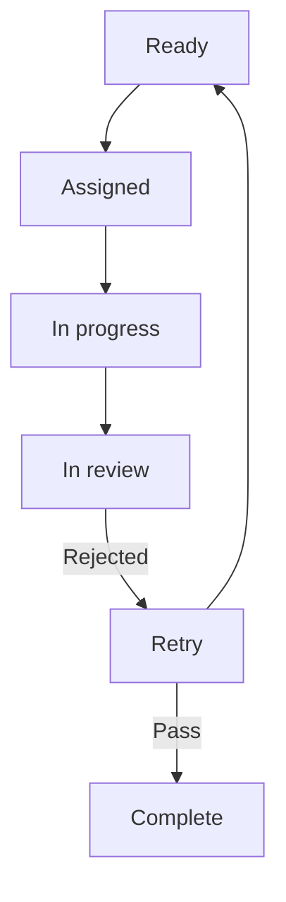

# Process

CTO plans and creates tickets and acceptance criteria in vikunja

Tech Lead
- aware of worker

```mermaid
flowchart TD
    A["Ready"]
    B["Assigned"]
    C["In progress"]
    D["In review"]
    E["Retry"]
    F["Complete"]

    A --> B
    B --> C
    C --> D
    D --> |"Rejected"|E
    E --> A
    E --> |"Pass"|F
```