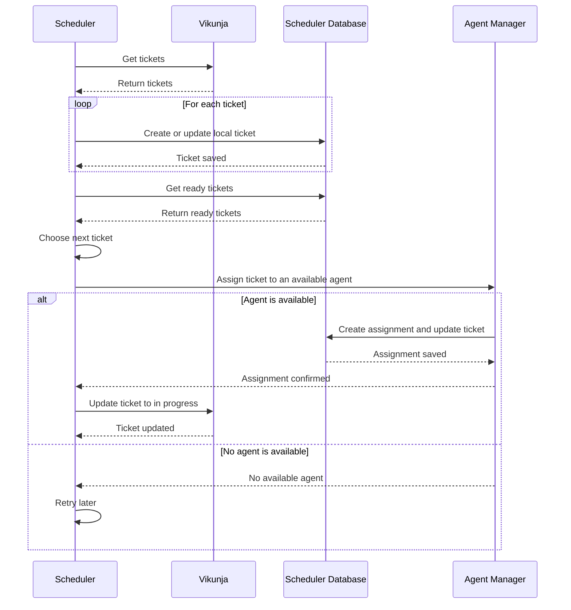

# Communication

```mermaid
sequenceDiagram
    participant S as Scheduler
    participant V as Vikunja
    participant DB as Scheduler Database
    participant A as Agent Manager

    S->>V: Get tickets
    V-->>S: Return tickets

    loop For each ticket
        S->>DB: Create or update local ticket
        DB-->>S: Ticket saved
    end

    S->>DB: Get ready tickets
    DB-->>S: Return ready tickets
    S->>S: Choose next ticket

    S->>A: Assign ticket to an available agent

    alt Agent is available
        A->>DB: Create assignment and update ticket
        DB-->>A: Assignment saved
        A-->>S: Assignment confirmed
        S->>V: Update ticket to in progress
        V-->>S: Ticket updated
    else No agent is available
        A-->>S: No available agent
        S->>S: Retry later
    end
```