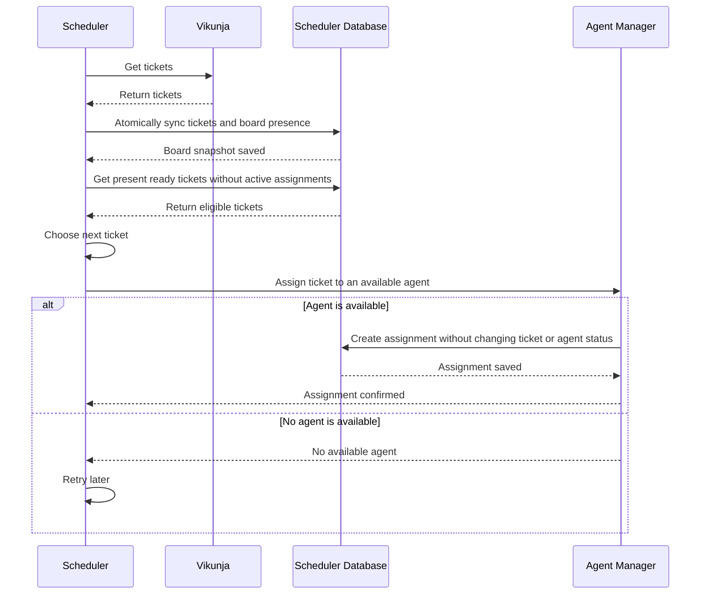

# Communication

Estimated reading time: 1 minute (150 WPM)

```mermaid
sequenceDiagram
    participant S as Scheduler
    participant V as Vikunja
    participant DB as Scheduler Database
    participant A as Agent Manager

    S->>V: Get tickets
    V-->>S: Return tickets

    S->>DB: Atomically sync tickets and board presence
    DB-->>S: Board snapshot saved

    S->>DB: Get present ready tickets without active assignments
    DB-->>S: Return eligible tickets
    S->>S: Choose next ticket

    S->>A: Assign ticket to an available agent

    alt Agent is available
        A->>DB: Create assignment without changing ticket or agent status
        DB-->>A: Assignment saved
        A-->>S: Assignment confirmed
    else No agent is available
        A-->>S: No available agent
        S->>S: Retry later
    end
```
