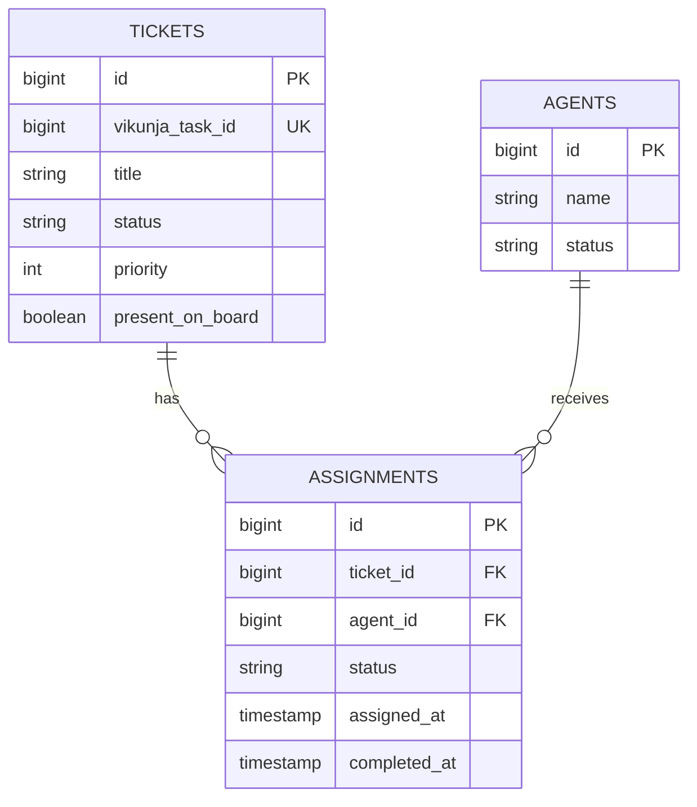

# Database

Estimated reading time: 1 minute (150 WPM)

```mermaid
erDiagram
    TICKETS ||--o{ ASSIGNMENTS : has
    AGENTS ||--o{ ASSIGNMENTS : receives

    TICKETS {
        bigint id PK
        bigint vikunja_task_id UK
        string title
        string status
        int priority
        boolean present_on_board
    }

    AGENTS {
        bigint id PK
        string name
        string status
    }

    ASSIGNMENTS {
        bigint id PK
        bigint ticket_id FK
        bigint agent_id FK
        string status
        timestamp assigned_at
        timestamp completed_at
    }
```
